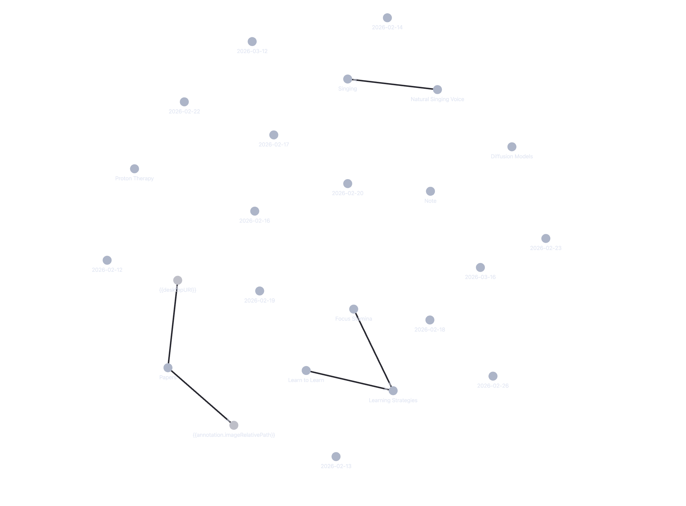

  

---

I am a Ph.D. student in the Nuclear & Radiological Engineering and Medical Physics (NREMP) program at Georgia Tech. My research involves exploring ways to accelerate proton therapy simulations using GPU-optimized code and ML surrogate models.

## 🔬 Research & Project Showcase

<table border="0">
  <tr>
    <td width="33.3%" valign="top">
      
      
      

        <b>Accelerated SIEMAC</b> 
        <small>GPU-accelerated radiation transport using Diffusion Models.</small> 
        <code>TOPAS</code> <code>CUDA</code> <code>PyTorch</code>
      

    </td>
    <td width="33.3%" valign="top">
      
      
      

        <b>nnUNet Medical Imaging</b> 
        <small>Segmentation framework for clinical radiation therapy.</small> 
        <code>PyTorch</code> <code>Medical-AI</code> <code>SimpleITK</code>
      

    </td>
    <td width="33.3%" valign="top">
      
      
      

        <b>Computational Origami</b> 
        <small>Simulator for complex crease pattern transformations.</small> 
        <code>Python</code> <code>Three.js</code> <code>Geometry</code>
      

    </td>
  </tr>
</table>

## 📚 Currently Exploring (via my Obsidian Vault)
* 🚀 **Accelerating Simulations:** Deep dive into Diffusion models for SIEMAC.
* ⚛️ **Clinical Physics:** Analyzing the biological mechanisms of the FLASH effect.
* 🤖 **AI in Medicine:** Optimization of PINNs for real-time dose calculation.
* 🛠️ **Systems:** Refining my "Learn to Learn" workflow for PhD-level research.

  
   

## 🐍 My Contribution Trail

  <picture>
    <source media="(prefers-color-scheme: dark)" srcset="https://raw.githubusercontent.com/amenon83/amenon83/output/github-contribution-grid-snake-dark.svg">
    <source media="(prefers-color-scheme: light)" srcset="https://raw.githubusercontent.com/amenon83/amenon83/output/github-contribution-grid-snake.svg">
    
  </picture>

  

