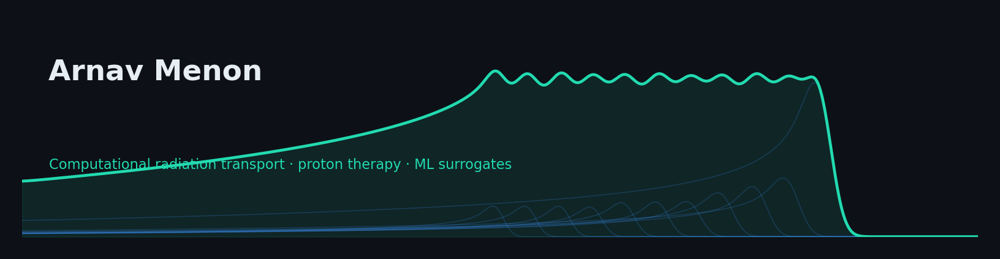

 Hi! My name is Arnav Menon.
====================================================================================================================================

Medical Physics Ph.D. Student @ Georgia Tech
-----------------------------

I am a Ph.D. student in the Nuclear & Radiological Engineering and Medical Physics (NREMP) program. My research focuses on the intersection of computational radiation transport and machine learning, specifically exploring ways to accelerate proton therapy simulations using GPU-optimized code and ML surrogate models. I’m passionate about bridging the gap between advanced physics modeling and clinical radiation therapy.

* 🌍  I'm based in Atlanta
* 🖥️  See my portfolio at [My Portfolio](http://arnavmenon.me)
* ✉️  You can contact me at [amenon83@gatech.edu](mailto:amenon83@gatech.edu)
* 🚀  I'm currently working on [nnUNet](http://github.com/amenon83/nnUNet_Project)
* 🧠  I'm currently learning Computational Radiation Transport
* 👥  I'm looking to collaborate on projects related to applying radiation physics to medicine.

### Current Activity

### Skills

### Socials

