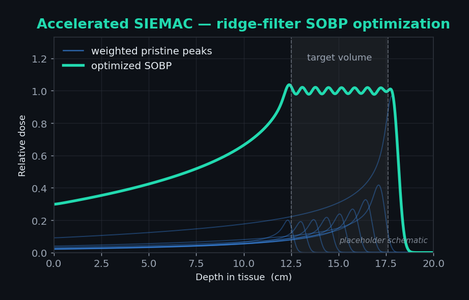
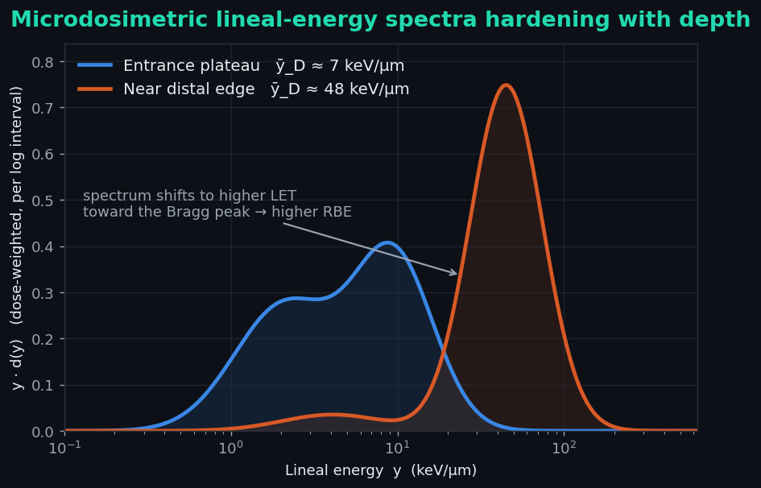
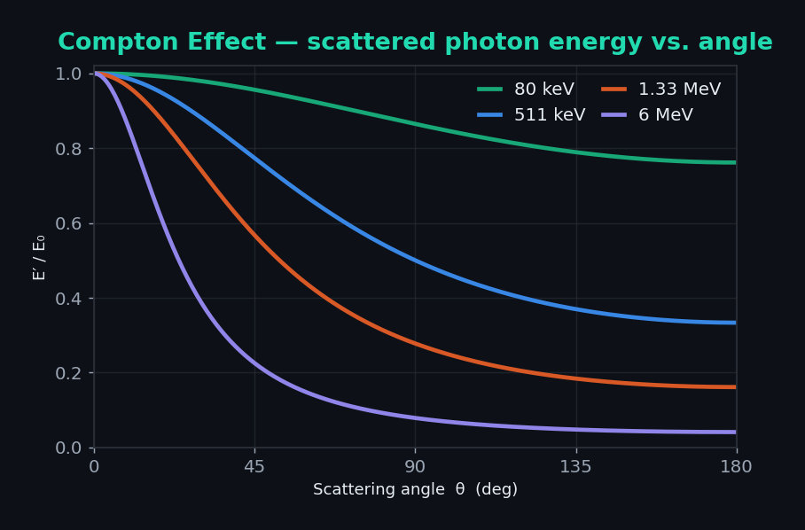

  

  
  
  

---

## 👋 About Me

I'm **Arnav Menon**, a Ph.D. student in the **Nuclear & Radiological Engineering and Medical Physics (NREMP)** program at **Georgia Tech**. I work at the intersection of **computational radiation transport** and **machine learning**, with the goal of making high-fidelity proton therapy simulation fast enough to use inside the clinical loop.

- 🔬 **Research focus** — GPU-accelerated Monte Carlo dose calculation and ML surrogate models (diffusion models, PINNs) for proton therapy.
- 🎯 **Why it matters** — proton therapy spares healthy tissue, but planning it well demands enormous simulation. I build methods that keep the physics accurate while cutting the compute from hours to seconds.
- 🧪 **Toolkit** — `TOPAS` / `Geant4` Monte Carlo, `CUDA`, `PyTorch`, inverse optimization, and microdosimetry.
- 🌱 **Currently** — connecting microdosimetric lineal-energy spectra to variable proton RBE, and accelerating ridge-filter design.
- 📫 **Reach me** — open an issue, or connect — always happy to talk medical physics, Monte Carlo, and ML for science.

---

## 🔬 Research & Project Showcase

<table border="0">
  <tr>
    <td width="33.3%" valign="top">
      
      

        <a href="https://github.com/amenon83/SIEMAC_card"><b>⚡ Accelerated SIEMAC</b></a> 
        Inverse-optimized <b>sparse ridge filter</b> that shapes a pristine proton peak into a flat spread-out Bragg peak — GPU/ML-accelerated.  
        <code>TOPAS</code> <code>CUDA</code> <code>PyTorch</code> <code>Optimization</code>
      

    </td>
    <td width="33.3%" valign="top">
      
      

        <a href="https://github.com/amenon83/lineal-energy"><b>📈 Lineal Energy &amp; Proton RBE</b></a>
         
        Microdosimetric <b>lineal-energy spectra</b> as a mechanistic input to variable proton RBE — a research proposal with a fast ML surrogate.  
        <code>Microdosimetry</code> <code>TOPAS</code> <code>MKM</code> <code>ML</code>
      

    </td>
    <td width="33.3%" valign="top">
      
      

        <a href="https://github.com/amenon83/compton-scattering"><b>🌀 Compton Scattering</b></a> 
        A small, runnable teaching sim of the <b>Compton effect</b>: kinematics, the Klein–Nishina cross section, and a Monte Carlo you can read line by line.  
        <code>Python</code> <code>NumPy</code> <code>Monte&nbsp;Carlo</code> <code>Physics</code>
      

    </td>
  </tr>
</table>

---

## 📡 Medical Physics Feed

The latest <b>physics.med-ph</b> preprints from <a href="https://arxiv.org/list/physics.med-ph/recent">arXiv</a>, auto-refreshed weekly by a GitHub Action. A snapshot of where the field is moving.

<!-- ARXIV-FEED:START -->
**[Direct probabilistic IMPT treatment planning with setup and range errors for neuro-oncological patients](https://arxiv.org/abs/2607.13869)**  
_Jelte R. de Jong, Sebastiaan Breedveld, Steven J. M. Habraken et al. · 2026-07-15_  
A probabilistic intensity-modulated proton therapy planning approach that optimizes directly for clinical goals under setup and range uncertainty, with patient-specific acceptance probabilities.

**[One-for-All Adaptive Radiotherapy Planning Agent: A Foundation Framework for Daily CBCT-guided Radiotherapy](https://arxiv.org/abs/2607.14870)**  
_Shaoyan Pan, Kirk Jon Luca, Yuan Gao et al. · 2026-07-16_  
A foundation-model agent that performs complete, treatment-specific online adaptive planning directly from daily cone-beam CT in under two minutes across multiple cancer sites.

**[A novel unsupervised machine learning strategy to handle multimodal cardiac PET/MRI data](https://arxiv.org/abs/2607.13936)**  
_Brunnhilde Ponsi, Thomas Carlier, Lara Marteau et al. · 2026-07-15_  
An unsupervised clustering approach on paired PET/MRI data to characterise myocardial heterogeneity in arrhythmogenic left-ventricular cardiomyopathy patients.

**[Operator-Informed Gaussian Processes for Complex Helmholtz Wavefields: From Synthetic Benchmarks to In Vivo Brain Elastography](https://arxiv.org/abs/2607.14193)**  
_Boyuan Deng, Kshitiz Upadhyay, Michael Shields · 2026-07-15_  
Operator-informed Gaussian-process regression extended to complex-valued Helmholtz problems for probabilistic wavefield inference in in-vivo brain elastography.

**[The Wulff bio-heat transfer model revisited: directional blood enthalpy transport and implications for laser-induced thermal therapy](https://arxiv.org/abs/2607.14017)**  
_Valerio D'Alessandro, Matteo Falone, Luca Giammichele et al. · 2026-07-15_  
A re-examination of the Wulff bio-heat formulation and the biological Péclet number, clarifying directional blood enthalpy transport for laser-induced thermal therapy.

**[Flow in a porous non-axisymmetric annular conduit: coupling wall compliance and peristalsis](https://arxiv.org/abs/2607.15239)**  
_Nishanth Surianarayanan, Ivan C. Christov · 2026-07-16_  
A model of peristaltic pumping in non-axisymmetric annular conduits with porous drag and two-way fluid–structure coupling between the compliant wall and cerebrospinal fluid flow.

_Updated: 2026-07-19 · source: arXiv physics.med-ph_
<!-- ARXIV-FEED:END -->

---

## 🐍 My Contribution Trail

  <picture>
    <source media="(prefers-color-scheme: dark)" srcset="https://raw.githubusercontent.com/amenon83/amenon83/output/github-contribution-grid-snake-dark.svg">
    <source media="(prefers-color-scheme: light)" srcset="https://raw.githubusercontent.com/amenon83/amenon83/output/github-contribution-grid-snake.svg">
    
  </picture>

  

