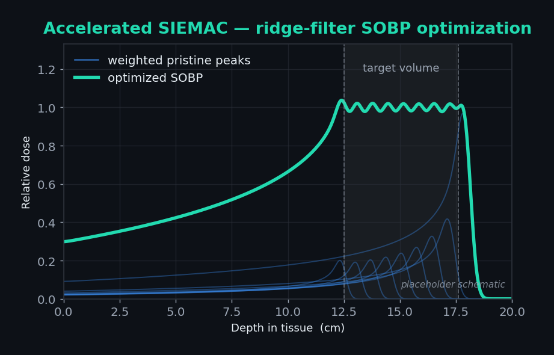
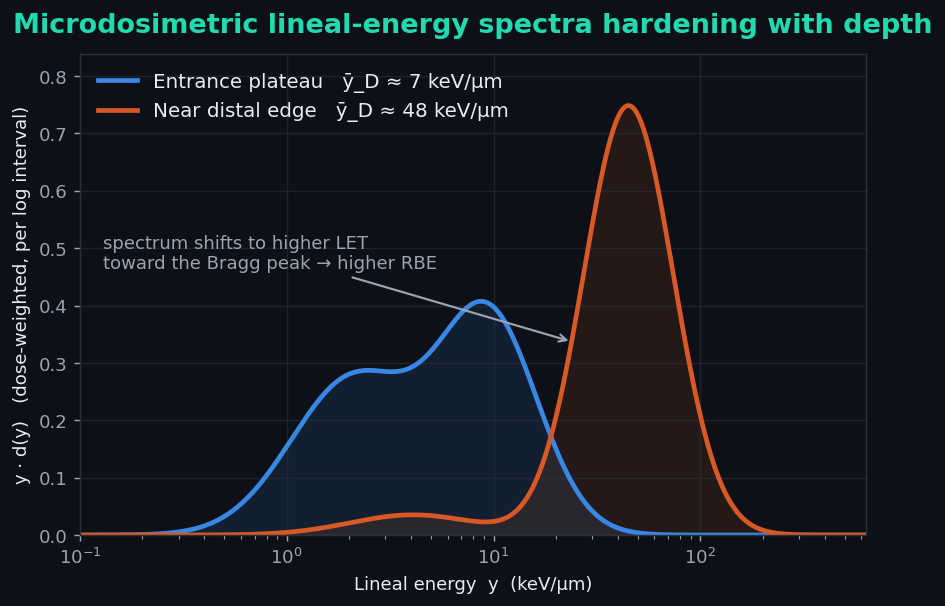
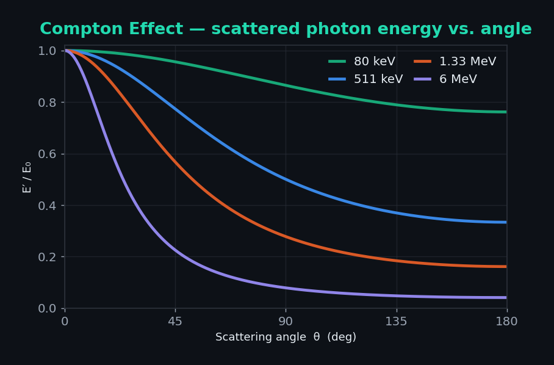

  

---

## 👋 About Me

I'm **Arnav Menon**, a Ph.D. student in the **Nuclear & Radiological Engineering and Medical Physics (NREMP)** program at **Georgia Tech**. I work at the intersection of **computational radiation transport** and **machine learning**, with the goal of making high-fidelity proton therapy simulation fast enough to use inside the clinical loop.

- 🔬 **Research focus** — GPU-accelerated Monte Carlo dose calculation and ML surrogate models (diffusion models, PINNs) for proton therapy.
- 🎯 **Why it matters** — proton therapy spares healthy tissue, but planning it well demands enormous simulation. I build methods that keep the physics accurate while cutting the compute from hours to seconds.
- 🧪 **Toolkit** — `TOPAS` / `Geant4` Monte Carlo, `CUDA`, `PyTorch`, inverse optimization, and microdosimetry.
- 🌱 **Currently** — connecting microdosimetric lineal-energy spectra to variable proton RBE, and accelerating ridge-filter design.
- 📫 **Reach me** — open an issue, or connect — always happy to talk medical physics, Monte Carlo, and ML for science.

---

## 🔬 Research & Project Showcase

<table border="0">
  <tr>
    <td width="33.3%" valign="top">
      
      

        <a href="https://github.com/amenon83/SIEMAC_card"><b>⚡ Accelerated SIEMAC</b></a> 
        Inverse-optimized <b>sparse ridge filter</b> that shapes a pristine proton peak into a flat spread-out Bragg peak — GPU/ML-accelerated.  
        <code>TOPAS</code> <code>CUDA</code> <code>PyTorch</code> <code>Optimization</code>
      

    </td>
    <td width="33.3%" valign="top">
      
      

        <a href="https://github.com/amenon83/lineal-energy"><b>📈 Lineal Energy &amp; Proton RBE</b></a>
         
        Microdosimetric <b>lineal-energy spectra</b> as a mechanistic input to variable proton RBE — a research proposal with a fast ML surrogate.  
        <code>Microdosimetry</code> <code>TOPAS</code> <code>MKM</code> <code>ML</code>
      

    </td>
    <td width="33.3%" valign="top">
      
      

        <a href="https://github.com/amenon83/compton-scattering"><b>🌀 Compton Scattering</b></a> 
        A small, runnable teaching sim of the <b>Compton effect</b>: kinematics, the Klein–Nishina cross section, and a Monte Carlo you can read line by line.  
        <code>Python</code> <code>NumPy</code> <code>Monte&nbsp;Carlo</code> <code>Physics</code>
      

    </td>
  </tr>
</table>

---

## 📡 Medical Physics Feed

The latest <b>physics.med-ph</b> preprints from <a href="https://arxiv.org/list/physics.med-ph/recent">arXiv</a>, auto-refreshed weekly by a GitHub Action. A snapshot of where the field is moving.

<!-- ARXIV-FEED:START -->
**[CBCT-IQ: A Publicly Available Annotated Cone-Beam CT Dataset for Image Quality Assessment and Benchmarking](https://arxiv.org/abs/2607.29253v1)**  
_Sepideh Hatamikia, Anna Breger, Clemens Karner et al. · 2026-07-31_  
Medical image quality plays a critical role in diagnostic accuracy, especially in X-ray-based imaging modalities such as cone-beam computed tomography (CBCT), where image quality must be balanced…

**[Intestinal peristalsis and wrinkling: A novel paradigm](https://arxiv.org/abs/2607.29204v1)**  
_René Thierry Djoumessi, Christopher Miller, Nipuni D. Nagahawatte et al. · 2026-07-31_  
A new computational framework for modeling the intestinal wall as a multi-layered fiber-reinforced continuum is presented. The framework reproduces for the first time physiological motility and…

**[MWF-MIMOSA for efficient simultaneous relaxometry and myelin water fraction mapping](https://arxiv.org/abs/2607.28984v1)**  
_Yuting Chen, Yohan Jun, Hyeong-Geol Shin et al. · 2026-07-31_  
Quantitative magnetic resonance imaging (qMRI) provides improved sensitivity and specificity to tissue composition and pathological alterations compared with conventional contrast-weighted imaging…

**[A reduced viscoelastic FDTD formulation for ultrasound-driven shear wave propagation in soft tissue](https://arxiv.org/abs/2607.28414v1)**  
_Gianmarco Pinton · 2026-07-30_  
Ultrasound-driven shear wave propagation in soft tissue underlies shear wave elastography (SWE) and emerging elastomechanical hypotheses of ultrasonic neuromodulation, both of which require accurate…

**[Establishing an independent measurement traceability for 60-Co Air Kerma](https://arxiv.org/abs/2607.27875v1)**  
_Néstor Cornejo-Díaz, Cristina García-Mulas, Paz Aviés-Lucas · 2026-07-30_  
An independent air kerma traceability chain for $^{60}$Co radiation protection levels has been successfully established at the CIEMAT Ionizing Radiation Metrology Laboratory (LMRI-CIEMAT), based on…

**[Bounded-Latency Spherical-Histogram Reconstruction for Compton Cameras](https://arxiv.org/abs/2607.27785v1)**  
_Francisco J. Albiol, Luis Caballero, José Escalante et al. · 2026-07-30_  
Gamma-ray imaging with Compton cameras is computationally demanding because conventional reconstruction retains the list-mode acquisition inside the inversion loop: event-dependent cone/voxel…

_Updated: 2026-08-03 · source: arXiv physics.med-ph_
<!-- ARXIV-FEED:END -->

---

## 🐍 My Contribution Trail

  <picture>
    <source media="(prefers-color-scheme: dark)" srcset="https://raw.githubusercontent.com/amenon83/amenon83/output/github-contribution-grid-snake-dark.svg">
    <source media="(prefers-color-scheme: light)" srcset="https://raw.githubusercontent.com/amenon83/amenon83/output/github-contribution-grid-snake.svg">
    
  </picture>

  

