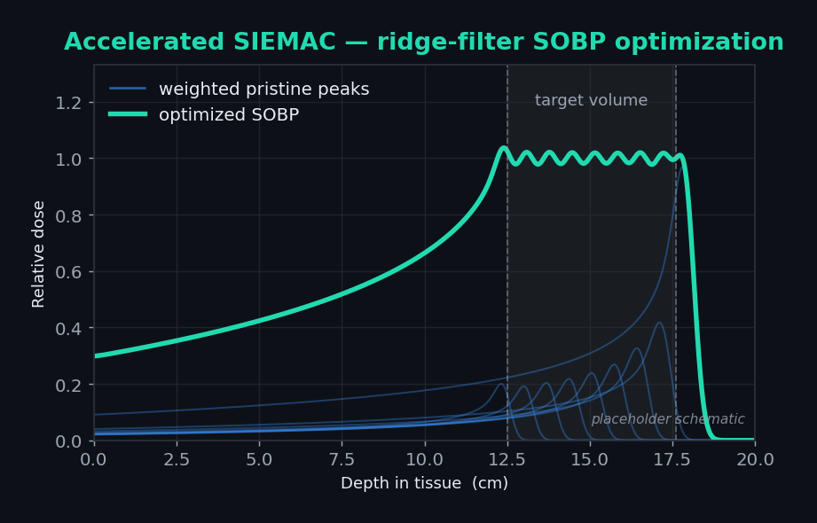
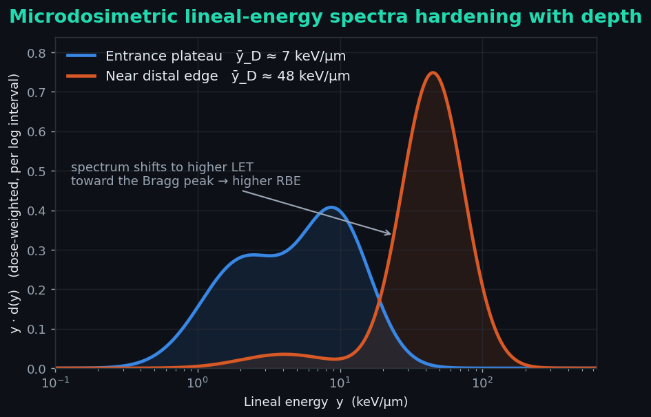
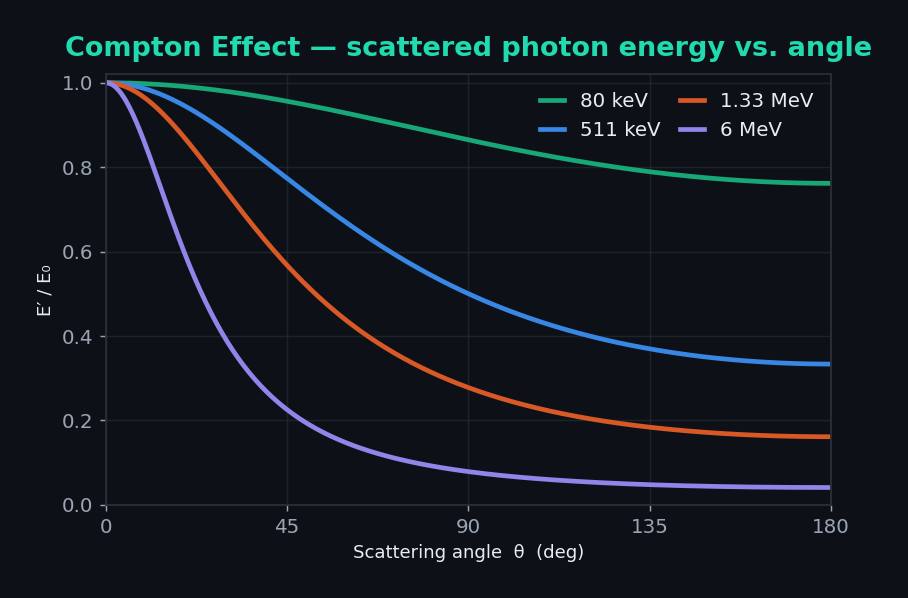

  

---

## 👋 About Me

I'm **Arnav Menon**, a Ph.D. student in the **Nuclear & Radiological Engineering and Medical Physics (NREMP)** program at **Georgia Tech**. I work at the intersection of **computational radiation transport** and **machine learning**, with the goal of making high-fidelity proton therapy simulation fast enough to use inside the clinical loop.

- 🔬 **Research focus** — GPU-accelerated Monte Carlo dose calculation and ML surrogate models (diffusion models, PINNs) for proton therapy.
- 🎯 **Why it matters** — proton therapy spares healthy tissue, but planning it well demands enormous simulation. I build methods that keep the physics accurate while cutting the compute from hours to seconds.
- 🧪 **Toolkit** — `TOPAS` / `Geant4` Monte Carlo, `CUDA`, `PyTorch`, inverse optimization, and microdosimetry.
- 🌱 **Currently** — connecting microdosimetric lineal-energy spectra to variable proton RBE, and accelerating ridge-filter design.
- 📫 **Reach me** — open an issue, or connect — always happy to talk medical physics, Monte Carlo, and ML for science.

---

## 🔬 Research & Project Showcase

<table border="0">
  <tr>
    <td width="33.3%" valign="top">
      
      

        <a href="https://github.com/amenon83/SIEMAC_card"><b>⚡ Accelerated SIEMAC</b></a> 
        Inverse-optimized <b>sparse ridge filter</b> that shapes a pristine proton peak into a flat spread-out Bragg peak — GPU/ML-accelerated.  
        <code>TOPAS</code> <code>CUDA</code> <code>PyTorch</code> <code>Optimization</code>
      

    </td>
    <td width="33.3%" valign="top">
      
      

        <a href="https://github.com/amenon83/lineal-energy"><b>📈 Lineal Energy &amp; Proton RBE</b></a>
         
        Microdosimetric <b>lineal-energy spectra</b> as a mechanistic input to variable proton RBE — a research proposal with a fast ML surrogate.  
        <code>Microdosimetry</code> <code>TOPAS</code> <code>MKM</code> <code>ML</code>
      

    </td>
    <td width="33.3%" valign="top">
      
      

        <a href="https://github.com/amenon83/compton-scattering"><b>🌀 Compton Scattering</b></a> 
        A small, runnable teaching sim of the <b>Compton effect</b>: kinematics, the Klein–Nishina cross section, and a Monte Carlo you can read line by line.  
        <code>Python</code> <code>NumPy</code> <code>Monte&nbsp;Carlo</code> <code>Physics</code>
      

    </td>
  </tr>
</table>

---

## 📡 Medical Physics Feed

The latest <b>physics.med-ph</b> preprints from <a href="https://arxiv.org/list/physics.med-ph/recent">arXiv</a>, auto-refreshed weekly by a GitHub Action. A snapshot of where the field is moving.

<!-- ARXIV-FEED:START -->
**[MIRTO: a registration-gated, multiverse-tested evaluation protocol for unsupervised anomaly segmentation in brain MRI](https://arxiv.org/abs/2610.02136v1)**  
_Negin Kafee Hernashki, Soumick Chatterjee · 2026-10-01_  
Unsupervised anomaly detection (UAD) methods for brain MRI are ranked by a single score, yet that score rests on choices that are rarely reported: how each anomaly map is aligned with the reference…

**[Diffusion broadening of the point spread function in steady-state MRI](https://arxiv.org/abs/2610.02132v2)**  
_Bibek Dhakal, John C. Gore · 2026-10-01_  
Purpose: To demonstrate how diffusion blurs the longitudinal magnetization in steady-state gradient-echo imaging, quantify resolution dependence on flip angle and repetition time, and the effects on…

**[Towards 3D fully randomized frequency-domain reconstruction of the speed of sound in breast ultrasound computed tomography](https://arxiv.org/abs/2610.01930v1)**  
_Luca A. Forte · 2026-10-01_  
Ultrasound computed tomography is emerging as a promising diagnostic imaging tool. 2D geometries suffer from notorious out-of-plane scattering artifacts. Image reconstruction can be achieved with…

**[AnatomIQ: An Open-Source Toolkit for Automated Background Detection in Medical Imaging](https://arxiv.org/abs/2610.01686v1)**  
_Rafael Carballeira, Hayley A. Cash, Marthony L. Robins · 2026-10-01_  
Manual background selection for contrast-to-noise ratio (CNR) calculations in CT image quality assessment is time-consuming, operator-dependent, and compromises reproducibility. Advanced metrics such…

**[Quiet, rapid 3D multiparametric mapping using magnetization-prepared zero echo time MRI](https://arxiv.org/abs/2610.01330v1)**  
_Alireza Samadifardheris, Shishuai Wang, Ana Beatriz Solana et al. · 2026-10-01_  
Purpose: To introduce and evaluate MuPa-ZTE, a quiet, rapid 3D framework combining native and magnetization-prepared zero echo time (ZTE) acquisitions for multiparametric mapping. Methods: MuPa-ZTE…

**[Fiber-Resolved Microstructure Quantification from Multi-Shell Diffusion MRI using Detection Transformers](https://arxiv.org/abs/2609.39184v1)**  
_Sebastian Endt, Marcus Wirth, Johannes Reinhold Schlund et al. · 2026-09-30_  
Fiber orientation and compartmental microstructure are central to the characterization of white matter tissue in diffusion MRI, yet existing methods either resolve fiber orientations without…

_Updated: 2026-10-05 · source: arXiv physics.med-ph_
<!-- ARXIV-FEED:END -->

---

## 🐍 My Contribution Trail

  <picture>
    <source media="(prefers-color-scheme: dark)" srcset="https://raw.githubusercontent.com/amenon83/amenon83/output/github-contribution-grid-snake-dark.svg">
    <source media="(prefers-color-scheme: light)" srcset="https://raw.githubusercontent.com/amenon83/amenon83/output/github-contribution-grid-snake.svg">
    
  </picture>

  

